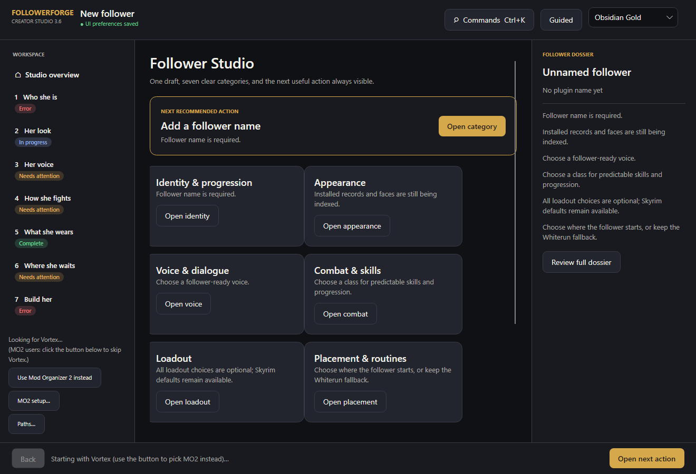

<p align="center">
  
</p>

<h1 align="center">FollowerForge</h1>

<p align="center"><strong>Read your load order. Build an installable Skyrim follower.</strong></p>

<p align="center">
  Out-of-game Windows app that indexes Vortex or Mod Organizer 2 and writes an ESPFE plus assets.<br>
  FollowerForge itself is <strong>not</strong> a Skyrim mod. Do not install the application into Skyrim <code>Data</code>, Vortex, or MO2 as game content.
</p>

<p align="center">
  <a href="https://github.com/ShugokiFable/FollowerForge/actions/workflows/ci.yml"></a>
  <a href="LICENSE"></a>
  <a href="https://github.com/ShugokiFable/FollowerForge/releases/tag/v3.7.0"></a>
</p>

<p align="center">
  <a href="https://github.com/ShugokiFable/FollowerForge/releases/latest">Download</a>
  ·
  <a href="#quick-start">Quick start</a>
  ·
  <a href="#honest-status">Honest status</a>
  ·
  <a href="CHANGELOG.txt">Changelog</a>
</p>

<p align="center">
  
</p>

<p align="center"><sub>Studio workspace, Obsidian Gold. Screenshot from the 3.7.0 tree (Studio shipped in 3.6.0).</sub></p>

## Quick start

Latest release: **[v3.7.0](https://github.com/ShugokiFable/FollowerForge/releases/tag/v3.7.0)** (`FollowerForge-3.7.0-win-x64.zip`). Self-contained Windows x64; no separate .NET install.

1. Extract the ZIP **anywhere outside Skyrim `Data`**.
2. Run `FollowerForge.exe`.
3. Start from **Studio**. Follow the next recommended action through the seven categories.
4. Press **Build follower**.
5. Install the **generated** follower package with Vortex or MO2, enable its plugin, and deploy.

RaceMenu **Export Head** NIF/DDS files are required for a custom face. A slider-only preset without usable exported head geometry may not reproduce the face on an NPC.

Recommended face workflow: [FaceForge](https://github.com/ShugokiFable/FaceForge) → RaceMenu Export Head → FollowerForge.

## Vortex and Mod Organizer 2

FollowerForge auto-detects Vortex first unless MO2 is preferred. The manager control in the left sidebar can switch between them before or during indexing.

MO2 users can click **MO2 setup...** to pick the exact `ModOrganizer.ini` and profile, inspect resolved paths, save that selection, or return to automatic detection. Click **Paths...** for xVASynth and the built-mod output folder.

Empty path boxes keep automatic detection. Game `Data` and the Skyrim saves folder are refused as output. Saved GUI settings live under `%LOCALAPPDATA%\FollowerForge`. FollowerForge does **not** modify MO2 profile/INI files, Vortex deployment data, Skyrim `Data`, or saves.

Do not point FollowerForge at a houseCARL Vortex shim unless you intentionally override the safety gate.

Detailed MO2 notes: [`FollowerForge 3.7.0/docs/MO2.md`](FollowerForge%203.7.0/docs/MO2.md).

## Studio (3.6.0+)

- Seven **Focus** categories and a next recommended action
- **Expert Deck** for installed records (FormID + EditorID)
- Guided / Expert (`Ctrl+E`) — Expert opens the catalogue; it does not hide fields
- Command palette (`Ctrl+K`); `Ctrl+0`–`Ctrl+7` jumps categories
- Five themes. Theme, experience, and window size are stored separately from follower profiles
- Sex on Identity updates she/her or he/him. Gear lists show FormIDs so identically named items can be told apart

## CLI and environment

| Option | Purpose |
| --- | --- |
| GUI manager button | Prefer MO2 or Vortex |
| GUI **MO2 setup...** | Select and persist the exact MO2 instance/profile |
| GUI **Paths...** | Set xVASynth and the built-mod output folder |
| `FFORGE_XVASYNTH` / `--xvasynth` | Override xVASynth discovery |
| `FFORGE_PREFER_MO2=1` | Try MO2 before Vortex |
| `FFORGE_MO2_INSTANCE=D:\path\to\instance` | Use that MO2 instance folder |
| `--mo2-instance DIR` | Exact MO2 instance in the CLI |
| `--mo2-profile NAME` | Exact MO2 profile in the CLI |
| `cli\FollowerForge.Cli.exe env` | Print the detected environment |
| `cli\FollowerForge.Cli.exe index` | Rebuild the catalogue |
| `cli\FollowerForge.Cli.exe races` | Races she can be built as |
| `cli\FollowerForge.Cli.exe races --creatures` | Races the transform picker offers |

## Requirements

- Windows 10 or 11
- Skyrim Special Edition or Anniversary Edition
- Vortex or Mod Organizer 2
- RaceMenu for custom faces

Optional integrations include xVASynth, dialogue overhauls, High Poly Head, and FSMP when the selected follower assets require them.

## Sharing generated followers

FollowerForge does not grant redistribution rights for third-party assets. Check every asset author’s permissions before uploading a generated follower.

## Honest status

Verified in this tree:

- `FollowerForge 3.7.0/` is the ship snapshot (`CURRENT.txt`)
- 489 Release tests (478 inherited + 11 new)
- End-to-end CLI build of legacy outfit + armour pieces + a creature transform race: **BUILD OK**, one warning, no errors
- Published plugin VMAD carries the chosen beast race; ship gate reads `HEDR=1.71`, ESL light

Not claimed:

- A creature transform surviving a real fight in game. `SetRace()` on a follower is engine behaviour this build cannot exercise
- That a RaceMenu body shape or overlay transfers into the plugin — they do not. The build now warns when shaped `bodyMorphs` are present
- Nexus upload of 3.7.0 (GitHub release is current; Nexus still lagged when this snapshot shipped)

## Build from source

Ship tree: `FollowerForge 3.7.0\`. Needs the .NET 8 SDK.

```powershell
cd "FollowerForge 3.7.0"
.\Build-FollowerForge.ps1
.\Publish-FollowerForge.ps1 -Version 3.7.0
```

## Credits

Skyrim, Vortex, Mod Organizer 2, RaceMenu, and related names belong to their owners. This project is unofficial.

## License

[MIT](LICENSE)

## Notes in 3.7.0

- Combat transformation can turn her into a **creature** (dragons, wolves, trolls, spriggans — whatever installed mods provide). Creature races stay out of the **identity** picker because they have no head data; that rule never applied to the race she **turns into**
- Choosing a legacy outfit **and** hand-picked armour no longer hard-fails the build. The outfit is what she starts in; the pieces stay in inventory
- Build warns when a RaceMenu preset carries a body shape a plugin cannot store

Earlier 3.6.x notes (Studio, Copy diagnostics, Clear on pickers) live in [`CHANGELOG.txt`](CHANGELOG.txt).
